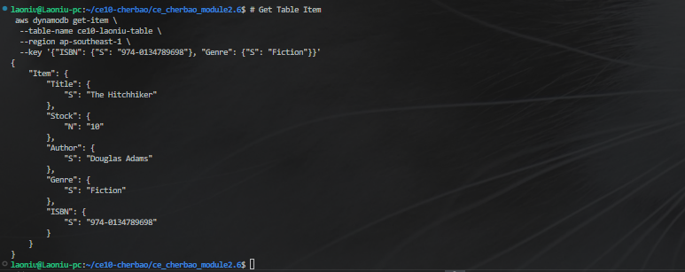

# Get Table Item
 aws dynamodb get-item \
  --table-name ce10-laoniu-table \
  --region ap-southeast-1 \
  --key '{"ISBN": {"S": "974-0134789698"}, "Genre": {"S": "Fiction"}}'

## Result - Get Table Item:

# List the available Dynamo Tables
aws dynamodb list-tables

## Result - List the available Dynamo Tables:

# Reads all items in the table
aws dynamodb scan --table-name ce10-laoniu-table

## Result - Reads all tables

## Challenge to test on the output the resource that I was created

# Delete DynamoDB Table
aws dynamodb delete-table --table-name ce10-laoniu-table

## Result - Delete DynamoDB Table
